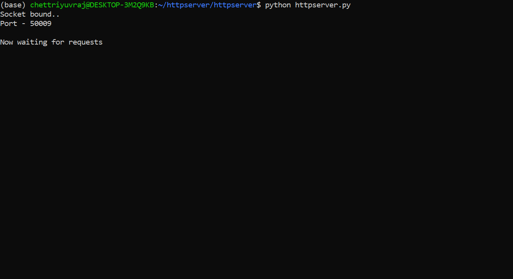

# httpserver

Python implementation of a HTTP server for serving static html files - text only. Can be used to fire up a local server that accepts http requests and serves html text-only files from the same directory. The script uses only the standard library and handles HTTP requests by itself without handlers such as SimpleHTTPRequestHandler.

## Screenshots:

Here, we fire up the code by running the main httpserver.py script. The TCP/IP socket uses port 50009. The server is now listening for HTTP requests.

Opening the browser, we type in 'localhost:50009/index.html'. 
On pressing enter - http request is sent to local server -the content of the index.html file (Hello World in this case) is displayed in the browser. 

Finally, on going back to the terminal, as evidence of the http request from the browser - the script displays the entire request header here. 

## How to run
1. The repository is to be cloned to the computer, following which the main script httpserver.py can be run straightaway - this creates TCP/IP socket, fires up the server which then listens for HTTP requests. (Screenshot 1)

2. Opening the browser, type in 'localhost:50009/index.html'. This means we are sending an HTTP request to the localserver - at port 50009 - requesting for index.html file. 
Ensure that there is an index.html file in the directory of the main httpserver script. (For convenience - the file is already provided)
On pressing enter - http request is sent to local server -the content of the index.html file (Hello World in this case) is displayed in the browser. (Screenshot 2)

3. To confirm http request and response, go back to terminal. The script displays the HTTP request from the browser in full. This is the http 'GET' request that clients send to servers when asking for a file.(Screenshot 3)

Possible issue: Connection refused when firing up the server - this might happen if the PORT(50009) is already being used by some other service. Change the PORT variable in httpserver script to some other large number (say 50008) and run the script again. 

## Future

- This was an extremely minimal implementation demonstrating the HTTP 'Get' request that clients send to servers. Would want to implement other HTTP requests (POST, et al) as well as a full-scale implementation of the 'GET' request.
- Figure out how to access server through remote computer using port forwarding
- Possibly write a piece on Medium documenting how/what I did 
